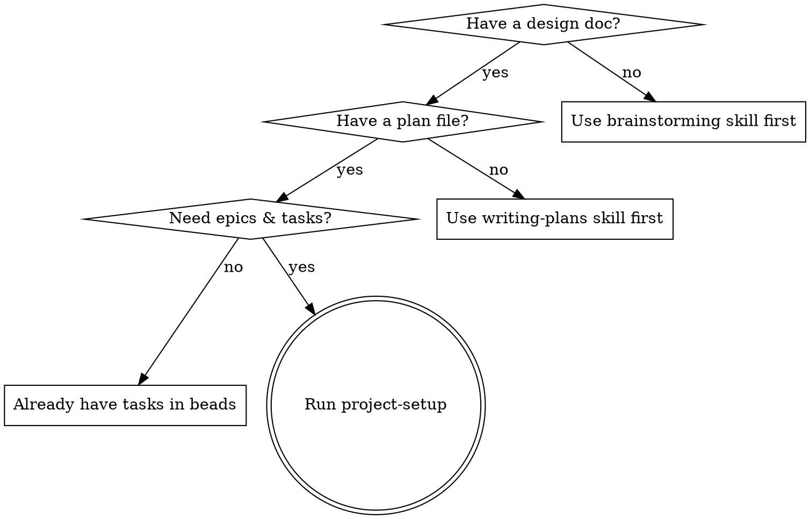

# Project Setup

Convert a plan file into beads epics and tasks with TDD-quality descriptions,
filled implementation prompts, and ready-to-use worktrees.

**Core principle:** Task descriptions are the source of truth. Each task is a
self-contained implementation guide — detailed enough for an agent to work
autonomously.

**Announce at start:** "I'm using the project-setup skill to decompose this plan
into epics and tasks."

## When to Use



**Don't use when:**

- No design doc exists yet — use brainstorming skill first
- No plan file exists yet — use writing-plans skill first
- Tasks already exist in beads — go straight to implementation

## Inputs

Primary input: **plan file path** (output of writing-plans, e.g.
`docs/plans/2026-02-21-feature-plan.md`). The plan references the design doc —
both are read in Phase 1.

Also needed from CLAUDE.md or conversation context:

- **Project root** — absolute path to the project
- **Tech stack** — languages, frameworks, tools in use
- **Quality commands** — test/lint commands (e.g. `make test && make lint`)
- **Coverage target** — minimum coverage threshold (e.g. `>80%`)

If any are missing, ask the user (prefer multiple choice when possible).

## Phase 1: Understand the Plan

Read the plan file and the design doc it references. Identify major phases,
components, data flow, and interfaces.

Use sub-agents to explore the codebase in parallel:

```text
# All launched in ONE message for parallel execution
Task(subagent_type="Explore", run_in_background=true,
  prompt="Explore {{PROJECT_ROOT}}. Map packages, interfaces, and patterns
  relevant to: {{FEATURE_DESCRIPTION}}.
  Write findings to output/planning/codebase-scan.md")

Task(subagent_type="general-purpose", model="haiku", run_in_background=true,
  prompt="Run: bd list --status=open, bd ready, bd blocked.
  Identify work related to {{FEATURE_DESCRIPTION}}.
  Write to output/planning/beads-context.md")
```

After agents complete, read the output files. Check `bd list` / `bd ready` /
`bd blocked` for related or overlapping work.

Ask the user focused questions (prefer multiple choice) about anything the plan
leaves ambiguous — constraints, scope boundaries, patterns to follow.

## Phase 2: Decompose into Epics & Tasks

### Map Plan Phases to Epics

Map each plan phase to a beads epic. Each epic should:

- Represent a cohesive, independently deliverable unit of work
- Be completable in 1-3 agent sessions
- Have clear boundaries (a single worktree/branch per epic)
- Map to a logical layer or component from the design spec

**Naming:** Imperative form — "Implement Sync Protocol", "Build Session
Manager", "Create Filter Component".

Present the epic breakdown to the user for approval before creating anything.

### Check Existing Worktrees

Before proposing new worktrees, check what already exists:

```bash
# List all active worktrees
git worktree list

# Check which are occupied with in-progress work
bd list --status=in_progress
```

Also check the worktree table in the project's root CLAUDE.md.

**Decision criteria:**

- Suggest **reusing** an idle worktree when its branch relates to the epic
- Suggest **reusing** a worktree that has no in-progress beads tasks
- Propose a **new worktree** only when no existing one is a reasonable fit

Propose branch names for any new worktrees. Derive paths from the CLAUDE.md
convention (e.g. `~/.workspaces/{repo}/{feature}`). Do not ask — infer from
context.

### Create Epics in Beads

Once the user approves the epic breakdown:

```bash
bd epic create --title="Epic Title"

# If epics have ordering dependencies:
bd dep add <later-epic-id> <earlier-epic-id>
```

### Create Tasks

When creating > 6 tasks, delegate to parallel sub-agents — one per epic:

```text
Task(subagent_type="general-purpose", model="haiku",
  prompt="Create these beads tasks under epic {{EPIC_1_ID}}:
  1. bd create --title='...' --type=task --priority=2 --description='...'
  2. bd create --title='...' --type=task --priority=1 --description='...'
  Then set ordering: bd dep add <later_id> <earlier_id>
  Return the created task IDs and their titles.")

Task(subagent_type="general-purpose", model="haiku",
  prompt="Create these beads tasks under epic {{EPIC_2_ID}}:
  ...")
```

After sub-agents return IDs, set cross-epic dependencies directly (requires IDs
from multiple sub-agents):

```bash
bd dep add <epic-2-id> <epic-1-id>

# Verify no circular dependencies
bd blocked
```

### Task Description Quality

Every beads task description is a **self-contained implementation guide**:

**Required sections:**

````markdown
## Files

- Create: `exact/path/to/new_file.go`
- Modify: `exact/path/to/existing.go` (add XyzService interface)
- Test: `exact/path/to/new_file_test.go`

## Steps

### Step 1: Write the failing test

```go
func TestSpecificBehavior(t *testing.T) {
    result := Function(input)
    assert.Equal(t, expected, result)
}
```

### Step 2: Implement

```go
func Function(input Type) ReturnType {
    // implementation
}
```

### Step 3: Verify and commit

```bash
go test ./path/to/package/... -run TestSpecificBehavior -v
git commit -m "feat(module): add specific feature"
```

## Acceptance Criteria

- [ ] All tests pass
- [ ] Function handles edge case X
- [ ] Error returns are typed, not generic
````

**Scale code detail to task type:**

| Task Type            | Code in Steps            | Test Detail                                   |
| -------------------- | ------------------------ | --------------------------------------------- |
| API/Interface design | Full signatures + types  | Contract tests, error case tests              |
| Business logic       | Full implementation code | TDD: failing test → implement → pass          |
| Integration/Wiring   | Connection code + config | Integration test against mock/real dependency |
| UI/Styling           | Full CSS/component code  | Visual verification steps, screenshot check   |
| Testing-only         | N/A                      | Full test code with scenarios and edge cases  |
| Documentation        | N/A (outline only)       | Verification: doc renders, links work         |

**Granularity:** Each task should be completable in one focused session (30-90
minutes). If a task has more than 5 steps, split it.

### Verify Setup

Before proceeding to Phase 3:

- [ ] Every task has a clear title and detailed description
- [ ] Task ordering within each epic makes sense (foundations first)
- [ ] Epic dependencies reflect the actual build order
- [ ] No circular dependencies (`bd blocked` should be clean)
- [ ] Each epic can be assigned to one worktree/branch
- [ ] Total scope is realistic (flag if > 20 tasks per epic)

## Phase 3: Generate Implementation Prompts

For each epic/worktree assignment, fill the
`toolkit/templates/agent-dev-workflow/implementation-agent.md` template and save
to `dev-docs/prompts/{feature}.md`.

**Placeholder table:**

| Placeholder            | Source                                              |
| ---------------------- | --------------------------------------------------- |
| `{{EPIC_ID}}`          | Beads epic ID from Phase 2                          |
| `{{WORKTREE_PATH}}`    | From worktree assignment (convention-based path)    |
| `{{BRANCH_NAME}}`      | Branch name for this epic                           |
| `{{DESIGN_DOC}}`       | Path to the design spec referenced by the plan file |
| `{{REFERENCE_CODE}}`   | Relevant reference code paths                       |
| `{{QUALITY_COMMANDS}}` | Test/lint commands                                  |
| `{{COVERAGE_TARGET}}`  | Coverage threshold (e.g., `>80%`)                   |
| `{{AGENT_NAME}}`       | Unique name (e.g., `impl-{feature}`)                |
| `{{PLAN_FILE}}`        | Path to the plan file (primary input)               |

Add a header with quick context before the filled template:

```markdown
# Implementation Prompt: {{FEATURE_NAME}}

> Generated by project-setup on YYYY-MM-DD Plan: {{PLAN_FILE}} Design doc:
> {{DESIGN_DOC}} Epic: {{EPIC_ID}} (N tasks)

## Quick Context

<!-- 2-3 sentences about what this epic delivers and key architectural decisions -->

## Worktree Setup

./scripts/setup-worktree-thrum.sh {{WORKTREE_PATH}} {{BRANCH_NAME}} \
 --identity {{AGENT_NAME}} --role implementer

## Implementation Agent Template

<!-- The filled-in implementation-agent.md follows below -->
```

After generating all prompt files, commit:

```bash
git add dev-docs/prompts/
git commit -m "plan: add implementation prompts for {{FEATURE_NAME}}"
```

## Phase 4: Create Worktrees

For **new worktrees**, use the setup script:

```bash
./scripts/setup-worktree-thrum.sh {{WORKTREE_PATH}} {{BRANCH_NAME}} \
  --identity {{AGENT_NAME}} --role implementer
```

Alternatively, invoke the `using-git-worktrees` skill.

For **reused worktrees**, verify redirects are intact:

```bash
# In the existing worktree
cat .thrum/redirect    # should point to <project-root>/.thrum
cat .beads/redirect    # should point to <project-root>/.beads
```

If the project root CLAUDE.md has a worktree table, update it with any new
entries.

## Common Mistakes

**Too vague tasks:** "Add validation" is not a step —
`if err := validate(input); err != nil { return fmt.Errorf(...) }` is. Prefer
complete code over pseudocode.

**Too large tasks:** If a task has more than 5 steps, split it. Each task = one
focused session.

**Missing dependencies:** Forgetting cross-epic deps leads to agents starting
work they can't finish. Always run `bd blocked` to verify.

**Skipping worktree reuse check:** Always run `git worktree list` and check
`bd list --status=in_progress` before proposing new worktrees. Creating
unnecessary worktrees adds overhead and clutter.

**Skipping the plan file:** This skill reads the plan file (from writing-plans)
as primary input. If you only have a design doc, use writing-plans first to
produce the plan.

## Output Summary

When complete, you should have produced:

1. **Beads epics and tasks** with dependency DAG and TDD-quality descriptions
2. **Filled implementation prompts** at `dev-docs/prompts/{feature}.md`
3. **Ready-to-use worktrees** with thrum/beads redirects configured
4. **All artifacts committed** to git

## Handoff

After setup is complete, each epic is ready for an implementation agent. The
filled prompt at `dev-docs/prompts/{feature}.md` is the session start prompt —
give it directly to the implementing agent. Use the **using-git-worktrees**
skill if additional workspace setup is needed.
