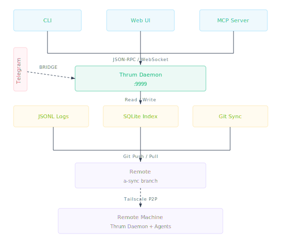

# Thrum

**Persistent messaging for AI agents.**

[](LICENSE)
[](https://goreportcard.com/report/github.com/leonletto/thrum)
[](https://github.com/leonletto/thrum/actions/workflows/ci.yml)
[](https://github.com/leonletto/thrum/releases)
[](go.mod)

Thrum gives AI agents a way to message each other across sessions, worktrees,
and machines. You direct the work. The agents coordinate through Thrum. Messages
persist through context compaction, session restarts, and machine changes —
nothing gets lost.

## Quick Start

```bash
# Install
curl -fsSL https://raw.githubusercontent.com/leonletto/thrum/main/scripts/install.sh | sh

# Initialize. On a TTY this launches an opinionated wizard that walks you
# through identity, worktrees root, role templates, and starts the daemon.
cd your-project
thrum init

# Send your first message (the wizard already registered your agent)
thrum send "Starting work on auth module" --to @implementer
thrum inbox
```

Need a non-interactive flow for CI? Pass `--non-interactive` for the legacy
silent init, or pre-fill every wizard prompt:

```bash
thrum init --name myagent --role planner --module auth \
           --worktrees-root ~/.thrum/worktrees/myproj \
           --roles=enhanced --no-daemon
```

## How It Works

Thrum is a single binary: CLI, daemon, web UI, and optional MCP server.



- **CLI-first.** Every agent that can run shell commands can use Thrum. No SDK,
  no framework, no protocol to implement.
- **Offline-first.** Everything works locally. Git push/pull syncs when ready.
- **Zero-conflict.** Messages live on a dedicated orphan branch — no merge
  conflicts with your code.
- **Inspectable.** Messages are JSONL files. State is a SQLite database. Sync is
  plain Git. If something goes wrong, you look at files.

## What You Can Do

- **Send and receive messages** — `thrum send`, `thrum inbox`, `thrum reply`
- **See what everyone is working on** — `thrum team`, `thrum who-has`
- **Coordinate agents across worktrees** — each worktree gets its own identity
- **Broadcast critical alerts** — escalations reach every active agent
- **Monitor in real time** — embedded web UI with live feed, threaded inbox,
  agent list
- **Get messages on your phone** — Telegram bridge with bidirectional threading
- **Sync across machines** — automatic Git sync, or Tailscale for real-time
  peer-to-peer

## Installation

### Install Script (recommended)

```bash
curl -fsSL https://raw.githubusercontent.com/leonletto/thrum/main/scripts/install.sh | sh
```

Downloads the prebuilt binary for your platform with SHA-256 checksum
verification.

### Homebrew

```bash
brew install leonletto/tap/thrum
```

### From Source

```bash
git clone https://github.com/leonletto/thrum.git
cd thrum
make install    # Builds UI + Go binary → ~/.local/bin/thrum
```

### Try beta releases

Every release soaks for 48h+ as `-rc.N` before going stable. To help test
releases before they're promoted, see
[Beta channel](https://thrum.team/docs/beta-channel.html).

## Daily Commands

You only need about 8 commands for daily use:

| Command                                    | What it does                     |
| ------------------------------------------ | -------------------------------- |
| `thrum quickstart --name NAME --role ROLE` | Register agent and start session |
| `thrum send "message" --to @name`          | Send a message                   |
| `thrum inbox`                              | Check your messages              |
| `thrum reply MSG_ID "response"`            | Reply to a message               |
| `thrum team`                               | See what everyone is working on  |
| `thrum who-has FILE`                       | Check who's editing a file       |
| `thrum overview`                           | Status, team, inbox in one view  |
| `thrum status`                             | Your current state               |

Everything else — agent lifecycle, sessions, context management — is
infrastructure that agents use programmatically. See the
[CLI Reference](https://thrum.team/docs/cli.html) for the full list.

## Agent Setup

### Install the Thrum Skill (All Agents)

```bash
thrum init --skills
```

Auto-detects your agent (Claude Code, Cursor, Codex, Gemini, Augment, Amp) and
installs the thrum skill to the right location. If multiple agents are detected,
you'll be prompted to choose. Works with any agent that supports the `SKILL.md`
format.

### Claude Code Plugin (Full Integration)

For Claude Code users who want the complete experience — slash commands,
automatic context injection, hooks, and startup scripts:

```bash
claude plugin marketplace add https://github.com/leonletto/thrum
claude plugin install thrum
```

See [Claude Code Plugin](https://thrum.team/docs/claude-code-plugin.html). If
the plugin is already installed, `thrum init --skills` will detect it and skip
the install.

### Any Agent via CLI

Any agent that can run shell commands works with Thrum. No plugin or skill
required — just call `thrum` from the command line.

## Documentation

Full documentation: **[thrum.team](https://thrum.team)**

- [Overview](https://thrum.team/docs/overview.html) |
  [Quickstart](https://thrum.team/docs/quickstart.html) |
  [CLI Reference](https://thrum.team/docs/cli.html) |
  [Architecture](https://thrum.team/docs/architecture.html)
- [Messaging](https://thrum.team/docs/messaging.html) |
  [Agent Coordination](https://thrum.team/docs/agent-coordination.html) |
  [Multi-Agent](https://thrum.team/docs/multi-agent.html) |
  [Sync](https://thrum.team/docs/sync.html)
- [Telegram Bridge](https://thrum.team/docs/telegram-bridge.html) |
  [Tailscale Sync](https://thrum.team/docs/tailscale-sync.html) |
  [Web UI](https://thrum.team/docs/web-ui.html)

## License

[MIT](LICENSE)
