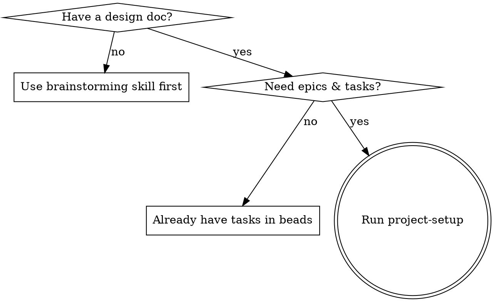

# Project Setup

Convert a design document into beads epics and tasks with TDD-quality
descriptions, ready for implementation agents.

**Core principle:** Task descriptions are the source of truth. Each task is a
self-contained implementation guide — detailed enough for an agent to work
autonomously.

**Announce at start:** "I'm using the project-setup skill to decompose this
design into epics and tasks."

## When to Use



**Don't use when:**

- No design doc exists yet — use brainstorming skill first
- Tasks already exist in beads — go straight to implementation

## Inputs

Gather these from the user or conversation context before proceeding:

- **Design doc path** — e.g. `dev-docs/plans/2026-02-20-feature-design.md`
- **Project root** — absolute path to the project
- **Tech stack** — languages, frameworks, tools in use
- **Quality commands** — test/lint commands (e.g. `npx vitest run`)

If any are missing, ask the user (prefer multiple choice when possible).

## Phase 1: Understand the Design

Read the design doc and identify major components, data flow, and interfaces.
Use sub-agents to explore the codebase in parallel — scan for existing patterns,
check `bd list` / `bd ready` / `bd blocked` for related work.

Ask the user focused questions (prefer multiple choice) about anything the
design doc leaves ambiguous — constraints, scope boundaries, patterns to follow.

## Phase 2: Create Epics & Tasks

### Identify Epics

Break the design into epics. Each epic should:

- Represent a cohesive, independently deliverable unit of work
- Be completable in 1-3 agent sessions
- Have clear boundaries (a single worktree/branch per epic)
- Map to a logical layer or component from the design spec

**Naming:** Imperative form — "Implement Sync Protocol", "Build Session
Manager", "Create Filter Component".

### Create Epics

```bash
bd create "Epic Title" --type=epic --priority=1

# If epics have ordering dependencies:
bd dep add <later-epic-id> <earlier-epic-id>
```

### Create Tasks

For each epic, create ordered tasks. Sequence so earlier tasks enable later ones
(foundations first). When creating many tasks (> 6), delegate to parallel
sub-agents — one per epic.

```bash
bd create "Task Title" --type=task --priority=2 \
  --parent=<epic-id> --description="Detailed description"

# Set ordering within the epic
bd dep add <later-task-id> <earlier-task-id>
```

**Task descriptions** are the source of truth for implementing agents. Each
description must include:

- **Files** — Exact paths to create, modify, and test
- **Acceptance Criteria** — Checkboxes: tests pass, edge cases handled, etc.

Scale code detail to task type: API tasks need full signatures/types, business
logic needs full implementation, integration tasks need the wiring (imports,
props, config).

**Granularity:** Each task should be completable in one focused session. If a
task has more than 5 steps, split it.

### Set Dependencies

```bash
# Cross-epic dependencies
bd dep add <epic-2-id> <epic-1-id>

# Verify no circular dependencies
bd blocked
```

### Verify Setup

Before finishing, validate:

- [ ] Every task has a clear title and detailed description
- [ ] Task ordering within each epic makes sense (foundations first)
- [ ] Epic dependencies reflect the actual build order
- [ ] No circular dependencies (`bd blocked` should be clean)
- [ ] Each epic can be assigned to one worktree/branch
- [ ] Total scope is realistic (flag if > 20 tasks per epic)

## Phase 3: Select Worktrees & Agents

**This phase is an interactive decision gate.** You MUST ask the user which
worktree and agent to use for each epic before generating prompts. Do not infer
silently — present options and let the user choose.

### Step 1: Gather Current State

```bash
# List all active worktrees with branches
git worktree list

# Check which worktrees have in-progress beads tasks
bd list --status=in_progress
```

Also check the CLAUDE.md worktree table for status info (active/idle/merged).

### Step 2: Present Worktree Options

For each epic, use `AskUserQuestion` to let the user choose a worktree:

| Scenario                                           | Option label                          |
| -------------------------------------------------- | ------------------------------------- |
| Existing idle worktree with related branch         | "Reuse `<path>` (`<branch>`)"        |
| Existing idle worktree, unrelated branch           | "Reuse `<path>`, create new branch"  |
| No suitable worktree exists                        | "Create new worktree"                |
| Work is small enough for the current branch        | "Use current worktree (`<branch>`)"  |

Include in each option's description: worktree path, current branch, whether
clean, existing agent registration, status from CLAUDE.md.

For agent names, suggest a name derived from the feature (e.g., `impl_{feature}`).

### Step 3: Set Up the Chosen Worktree

**For reused worktrees:**

```bash
cd <worktree-path>
git status                          # Check if clean
git fetch origin && git rebase origin/<dev-branch>  # Catch up if behind
cat .thrum/redirect                 # Verify redirect
cat .beads/redirect                 # Verify redirect
bd where                            # Confirm shared beads database
thrum quickstart --name <agent-name> --role implementer \
  --module <branch> --intent "Implementing <epic-id>"
```

If redirects are missing, run the worktree setup script in redirect-only mode.

**For new worktrees:**

```bash
# Use the project's setup script (if available)
./scripts/setup-worktree-thrum.sh <path> <branch> \
  --identity <agent-name> --role implementer --base <dev-branch>

# Or manually:
git worktree add <path> -b <branch> <dev-branch>
# Then set up redirects and register agent
```

**For current worktree:**

```bash
thrum quickstart --name <agent-name> --role implementer \
  --module <branch> --intent "Implementing <epic-id>"
bd where && bd ready    # Verify beads
```

### Step 4: Verify & Record

Verify for each worktree: `bd where`, `thrum daemon status`, redirect files.

Record the confirmed assignments:

| Epic | Worktree Path | Branch | Agent Name |
|------|---------------|--------|------------|
| `<epic-id>` | `<path>` | `<branch>` | `<agent-name>` |

These values feed into Phase 4 placeholder resolution.

## Phase 4: Generate Implementation Prompts

For each epic, generate an implementation prompt by filling in
`toolkit/templates/agent-dev-workflow/implementation-agent.md` placeholders.
All worktree-related values come from Phase 3:

| Placeholder             | Source                                       |
| ----------------------- | -------------------------------------------- |
| `{{EPIC_ID}}`           | Beads epic ID from Phase 2                   |
| `{{WORKTREE_PATH}}`     | **From Phase 3 worktree assignment**         |
| `{{BRANCH_NAME}}`       | **From Phase 3 worktree assignment**         |
| `{{DESIGN_DOC}}`        | Path to the design spec                      |
| `{{REFERENCE_CODE}}`    | Relevant reference code paths                |
| `{{QUALITY_COMMANDS}}`  | Test/lint commands                           |
| `{{COVERAGE_TARGET}}`   | Coverage threshold (e.g., >80%)              |
| `{{AGENT_NAME}}`        | **From Phase 3 agent registration**          |

Save filled prompts and commit.

## Common Mistakes

**Too vague tasks:** "Add validation" is not a step — `if (!text.trim()) return`
is. Prefer complete code over pseudocode.

**Too large tasks:** If a task has more than 5 steps, split it. Each task = one
focused session.

**Missing dependencies:** Forgetting cross-epic deps leads to agents starting
work they can't finish. Always run `bd blocked` to verify.

**Skipping worktree selection:** Always ask the user which worktree to use.
Never silently assign worktrees — present options and let the user choose.

**Generating prompts before worktree setup:** Prompts embed the worktree path,
branch, and agent name. These must be confirmed in Phase 3 before generating
prompts in Phase 4.

**Skipping the design doc:** This skill assumes a design doc exists. If you're
starting from a rough idea, use the brainstorming skill first.

## Output Summary

When complete, you should have produced:

1. **Beads epics and tasks** with dependency DAG and TDD-quality descriptions
2. **Ready-to-use worktrees** with redirects and agents registered
3. **Filled implementation prompts** ready to pass to sub-agents
4. **All artifacts committed** to git

## Handoff

After setup is complete, hand off each epic to an implementation agent using the
filled implementation prompt.
