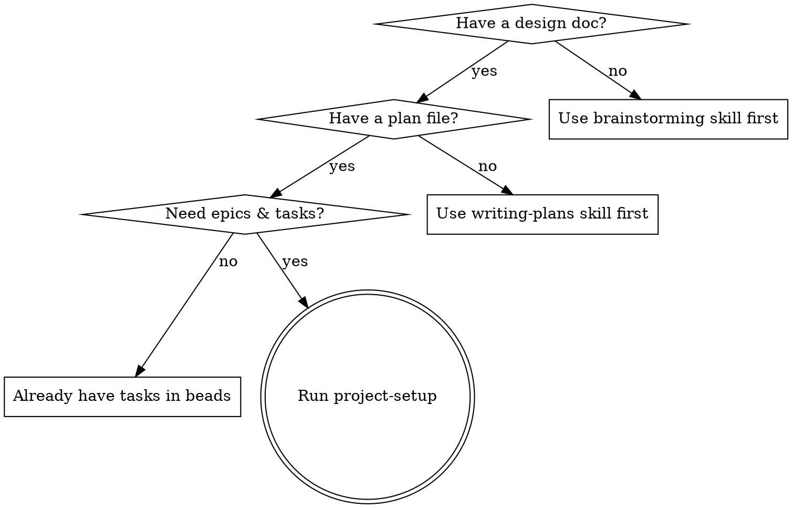

# Project Setup

Convert a plan file into beads epics and tasks with TDD-quality descriptions,
filled implementation prompts, and ready-to-use worktrees.

**Core principle:** Task descriptions are the source of truth. Each task is a
self-contained implementation guide — detailed enough for an agent to work
autonomously.

**Announce at start:** "I'm using the project-setup skill to decompose this plan
into epics and tasks."

## When to Use



**Don't use when:**

- No design doc exists yet — use brainstorming skill first
- No plan file exists yet — use writing-plans skill first
- Tasks already exist in beads — go straight to implementation

## Inputs

Primary input: **plan file path** (output of writing-plans, e.g.
`dev-docs/plans/2026-02-21-feature-plan.md`). The plan references the design doc —
both are read in Phase 1.

Also needed from CLAUDE.md or conversation context:

- **Project root** — absolute path to the project
- **Tech stack** — languages, frameworks, tools in use
- **Quality commands** — test/lint commands (e.g. `make test && make lint`)
- **Coverage target** — minimum coverage threshold (e.g. `>80%`)

If any are missing, ask the user (prefer multiple choice when possible).

## Phase 1: Understand the Plan

Read the plan file and the design doc it references. Identify major phases,
components, data flow, and interfaces.

Use sub-agents to explore the codebase in parallel:

```text
# All launched in ONE message for parallel execution
Task(subagent_type="Explore", run_in_background=true,
  prompt="Explore {{PROJECT_ROOT}}. Map packages, interfaces, and patterns
  relevant to: {{FEATURE_DESCRIPTION}}.
  Write findings to output/planning/codebase-scan.md")

Task(subagent_type="general-purpose", model="haiku", run_in_background=true,
  prompt="Run: bd list --status=open, bd ready, bd blocked.
  Identify work related to {{FEATURE_DESCRIPTION}}.
  Write to output/planning/beads-context.md")
```

After agents complete, read the output files. Check `bd list` / `bd ready` /
`bd blocked` for related or overlapping work.

Ask the user focused questions (prefer multiple choice) about anything the plan
leaves ambiguous — constraints, scope boundaries, patterns to follow.

## Phase 2: Decompose into Epics & Tasks

### Map Plan Phases to Epics

Map each plan phase to a beads epic. Each epic should:

- Represent a cohesive, independently deliverable unit of work
- Be completable in 1-3 agent sessions
- Have clear boundaries (a single worktree/branch per epic)
- Map to a logical layer or component from the design spec

**Naming:** Imperative form — "Implement Sync Protocol", "Build Session
Manager", "Create Filter Component".

Present the epic breakdown to the user for approval before creating anything.

### Create Epics in Beads

Once the user approves the epic breakdown:

```bash
bd create "Epic Title" --type=epic --priority=1

# If epics have ordering dependencies:
bd dep add <later-epic-id> <earlier-epic-id>
```

### Create Tasks

When creating > 6 tasks, delegate to parallel sub-agents — one per epic:

```text
Task(subagent_type="general-purpose", model="haiku",
  prompt="Create these beads tasks under epic {{EPIC_1_ID}}:
  1. bd create --title='...' --type=task --priority=2 --description='...'
  2. bd create --title='...' --type=task --priority=1 --description='...'
  Then set ordering: bd dep add <later_id> <earlier_id>
  Return the created task IDs and their titles.")

Task(subagent_type="general-purpose", model="haiku",
  prompt="Create these beads tasks under epic {{EPIC_2_ID}}:
  ...")
```

After sub-agents return IDs, set cross-epic dependencies directly (requires IDs
from multiple sub-agents):

```bash
bd dep add <epic-2-id> <epic-1-id>

# Verify no circular dependencies
bd blocked
```

### Task Description Quality

Every beads task description is a **self-contained implementation guide**:

**Required sections:**

````markdown
## Files

- Create: `exact/path/to/new_file.go`
- Modify: `exact/path/to/existing.go` (add XyzService interface)
- Test: `exact/path/to/new_file_test.go`

## Steps

### Step 1: Write the failing test

```go
func TestSpecificBehavior(t *testing.T) {
    result := Function(input)
    assert.Equal(t, expected, result)
}
```

### Step 2: Implement

```go
func Function(input Type) ReturnType {
    // implementation
}
```

### Step 3: Verify and commit

```bash
go test ./path/to/package/... -run TestSpecificBehavior -v
git commit -m "feat(module): add specific feature"
```

## Acceptance Criteria

- [ ] All tests pass
- [ ] Function handles edge case X
- [ ] Error returns are typed, not generic
````

**Scale code detail to task type:**

| Task Type            | Code in Steps            | Test Detail                                   |
| -------------------- | ------------------------ | --------------------------------------------- |
| API/Interface design | Full signatures + types  | Contract tests, error case tests              |
| Business logic       | Full implementation code | TDD: failing test → implement → pass          |
| Integration/Wiring   | Connection code + config | Integration test against mock/real dependency |
| UI/Styling           | Full CSS/component code  | Visual verification steps, screenshot check   |
| Testing-only         | N/A                      | Full test code with scenarios and edge cases  |
| Documentation        | N/A (outline only)       | Verification: doc renders, links work         |

**Granularity:** Each task should be completable in one focused session (30-90
minutes). If a task has more than 5 steps, split it.

### Verify Setup

Before proceeding to Phase 3:

- [ ] Every task has a clear title and detailed description
- [ ] Task ordering within each epic makes sense (foundations first)
- [ ] Epic dependencies reflect the actual build order
- [ ] No circular dependencies (`bd blocked` should be clean)
- [ ] Each epic can be assigned to one worktree/branch
- [ ] Total scope is realistic (flag if > 20 tasks per epic)

## Phase 3: Select Worktrees & Agents

**This phase is an interactive decision gate.** You MUST ask the user which
worktree and agent to use for each epic before generating prompts. Do not infer
silently — present options and let the user choose.

### Step 1: Gather Current State

Run these commands and present the results to the user:

```bash
# List all active worktrees with branches
git worktree list

# Check which worktrees have in-progress beads tasks
bd list --status=in_progress

# Check for active agents on each worktree
thrum team --json

# Check the CLAUDE.md worktree table for status info
# (read the "Worktree Layout" section from the project root CLAUDE.md)
```

Parse the `thrum team --json` output to map worktree paths to active agent
names. An agent is "active on a worktree" when its `worktree` field matches
the worktree path.

### Step 2: Present Worktree Options

For each epic, use `AskUserQuestion` to let the user choose a worktree. Build
the options from the gathered state:

**Option types to present:**

| Scenario                                           | Option label                          |
| -------------------------------------------------- | ------------------------------------- |
| Existing idle worktree with related branch         | "Reuse `<path>` (`<branch>`)"        |
| Existing idle worktree, unrelated branch           | "Reuse `<path>`, create new branch"  |
| No suitable worktree exists                        | "Create new worktree"                |
| Work is small enough for the current branch        | "Use current worktree (`<branch>`)"  |

Include in each option's description:
- The worktree path and current branch
- Whether it's clean or has uncommitted changes
- Whether it has an existing active agent (name it: e.g. "agent: impl_foo already registered")
- Its status from CLAUDE.md (active/idle/merged)

**For "Create new worktree"**, suggest:
- Path: `~/.workspaces/{repo}/{feature}` (from CLAUDE.md convention)
- Branch: `feature/{feature-name}` (from `thrum-dev`)

**For agent names**, suggest a name derived from the feature in each option
description (e.g., `impl_{feature}`). The user can override.

### Step 3: Set Up the Chosen Worktree

Based on the user's choice, execute the appropriate setup:

#### For reused worktrees:

```bash
cd <worktree-path>

# Check if clean
git status

# Fast-forward or rebase to thrum-dev if behind
git fetch origin thrum-dev
git rebase origin/thrum-dev
# OR if branches diverged: ask user before rebasing

# Verify redirects are intact
cat .thrum/redirect    # should point to <project-root>/.thrum
cat .beads/redirect    # should point to <project-root>/.beads

# If redirects are missing or wrong, fix them:
# (from project root)
./scripts/setup-worktree-thrum.sh <worktree-path>

# Verify beads sees shared database
bd where    # Should show <project-root>/.beads
bd ready    # Should show issues from the shared database
```

**Agent registration — check for an existing agent first:**

If `thrum team --json` showed an active agent on this worktree, **do not run
`thrum quickstart`**. Send the assignment directly to the existing agent:

```bash
# Existing agent already on this worktree — send work to them
thrum send "Assignment: implement <epic-id> (<epic-title>).
Worktree: <worktree-path>, branch: <branch-name>.
Start with: bd show <epic-id>" --to @<existing-agent-name>
```

If no active agent exists on the worktree, register a new one:

```bash
# No active agent — register a new one
thrum quickstart --name <agent-name> --role implementer \
  --module <branch-name> --intent "Implementing <epic-id>"
```

#### For new worktrees:

```bash
# From the project root — MUST pass --base thrum-dev
./scripts/setup-worktree-thrum.sh \
  <worktree-path> <branch-name> \
  --identity <agent-name> --role implementer --base thrum-dev
```

The setup script handles: branch creation, worktree creation, thrum redirect,
beads redirect, and `thrum quickstart` registration.

#### For current worktree (small fixes):

```bash
# Verify beads
bd where
bd ready
```

If an active agent already exists on the current worktree (from `thrum team
--json`), send the assignment to them. Otherwise register a new agent:

```bash
# If existing agent on this worktree:
thrum send "Assignment: implement <epic-id>" --to @<existing-agent-name>

# If no active agent:
thrum quickstart --name <agent-name> --role implementer \
  --module <current-branch> --intent "Implementing <epic-id>"
```

### Step 4: Verify Setup

Before proceeding to Phase 4, verify for each worktree:

```bash
cd <worktree-path>

# Beads sees shared database
bd where
# Expected: <project-root>/.beads

# Issues are visible
bd ready

# Thrum daemon reachable
thrum daemon status

# Redirects correct
cat .thrum/redirect
cat .beads/redirect

# Agent registered
thrum agent list --context
```

### Step 5: Update CLAUDE.md

If a new worktree was created, update the worktree table in the project root
CLAUDE.md. Use the existing table format:

```markdown
| `<path>` | `<branch>` | <purpose> | active |
```

### Troubleshooting

**"not in a bd workspace"** — The beads redirect file is missing or incorrect:

```bash
ls -la .beads/
cat .beads/redirect
bd where
# Fix: run setup-worktree-thrum.sh <path> (redirect-only mode)
```

**Wrong database** — `bd where` shows a local database instead of shared:

```bash
bd where
# Should show <project-root>/.beads, not a local database
# Fix: rm .beads/*.db && re-run setup script
```

**Sync warnings in worktrees** — Warnings about "snapshot validation failed" or
"git status failed" are **normal** in worktrees. If the final output shows
success, it's fine.

### Record Worktree Assignments

At the end of this phase, you should have a confirmed assignment for each epic:

| Epic | Worktree Path | Branch | Agent Name |
|------|---------------|--------|------------|
| `<epic-id>` | `<path>` | `<branch>` | `<agent-name>` |

These values feed directly into the `{{PLACEHOLDER}}` resolution in Phase 4.

## Phase 4: Generate Implementation Prompts

For each epic/worktree assignment, generate a filled prompt file.

### Step 1: Read the template

```text
Read toolkit/templates/agent-dev-workflow/implementation-agent.md
```

This is the **source template**. Do not work from memory — read the actual file
every time.

### Step 2: Resolve all placeholders

Perform literal find-and-replace on every `{{PLACEHOLDER}}` in the template.
All worktree-related values come from the Phase 3 assignments:

| Placeholder            | Source                                              |
| ---------------------- | --------------------------------------------------- |
| `{{EPIC_ID}}`          | Beads epic ID from Phase 2                          |
| `{{EPIC_TITLE}}`       | Epic title (used in commit messages)                |
| `{{WORKTREE_PATH}}`    | **From Phase 3 worktree assignment**                |
| `{{BRANCH_NAME}}`      | **From Phase 3 worktree assignment**                |
| `{{PROJECT_ROOT}}`     | Absolute path to the project root                   |
| `{{DESIGN_DOC}}`       | **Absolute path** to the design spec                |
| `{{REFERENCE_CODE}}`   | Relevant reference code paths (relative OK if committed) |
| `{{QUALITY_COMMANDS}}` | Test/lint commands                                  |
| `{{COVERAGE_TARGET}}`  | Coverage threshold (e.g., `>80%`)                   |
| `{{AGENT_NAME}}`       | **From Phase 3 agent registration**                 |
| `{{PLAN_FILE}}`        | **Absolute path** to the plan file (primary input)  |

**IMPORTANT — Absolute paths for gitignored files:** `{{DESIGN_DOC}}`,
`{{PLAN_FILE}}`, and the saved prompt path (`dev-docs/prompts/`) are typically
gitignored. Agents in worktrees cannot resolve relative paths to these files
because worktrees only share committed content. Always resolve these to absolute
paths (e.g., `/Users/you/project/dev-docs/plans/file.md`, not
`dev-docs/plans/file.md`). This also applies to beads task descriptions — any
reference to a plan or design doc in a task description must be an absolute path.

**Do not omit, reorganize, or summarize any section of the template.** The
output must contain every section from the original — Sub-Agent Strategy, all 4
Phases, Resume Quick Reference, etc. — with placeholders replaced by resolved
values.

### Step 3: Prepend feature-specific context

Add a header before the filled template with quick context, task inventory, and
architecture notes specific to this feature:

```markdown
# Implementation Prompt: {{FEATURE_NAME}}

> Generated by project-setup on YYYY-MM-DD Plan: {{PLAN_FILE}} Design doc:
> {{DESIGN_DOC}} Epic: {{EPIC_ID}} (N tasks)

## Quick Context

<!-- 2-3 sentences about what this epic delivers and key decisions -->

<!-- Optional: task inventory table, architecture notes, suggested batches -->

## Worktree Setup

<!-- If worktree was already created in Phase 3 and an existing agent was found: -->
Worktree ready at `{{WORKTREE_PATH}}` on branch `{{BRANCH_NAME}}`.
Assignment sent to existing agent `{{AGENT_NAME}}` via `thrum send`.

<!-- If worktree was already created in Phase 3 and a new agent was registered: -->
Worktree ready at `{{WORKTREE_PATH}}` on branch `{{BRANCH_NAME}}`.
Agent `{{AGENT_NAME}}` registered via `thrum quickstart`.

<!-- If worktree needs to be created by the implementation agent: -->
./scripts/setup-worktree-thrum.sh {{WORKTREE_PATH}} {{BRANCH_NAME}} \
 --identity {{AGENT_NAME}} --role implementer --base thrum-dev

---

## Implementation Agent Template

<!-- PASTE THE ENTIRE filled template below this line — every section, verbatim -->
```

### Step 4: Save and commit

Save to `dev-docs/prompts/{feature}.md`, then commit:

```bash
git add dev-docs/prompts/
git commit -m "plan: add implementation prompts for {{FEATURE_NAME}}"
```

## Common Mistakes

**Too vague tasks:** "Add validation" is not a step —
`if err := validate(input); err != nil { return fmt.Errorf(...) }` is. Prefer
complete code over pseudocode.

**Too large tasks:** If a task has more than 5 steps, split it. Each task = one
focused session.

**Missing dependencies:** Forgetting cross-epic deps leads to agents starting
work they can't finish. Always run `bd blocked` to verify.

**Skipping worktree selection:** Always ask the user which worktree to use.
Check `git worktree list` and `bd list --status=in_progress` for idle worktrees
before proposing new ones. Never silently assign worktrees.

**Duplicate agent registration:** Always run `thrum team --json` before
registering a new agent. If an agent is already active on the target worktree,
send them the assignment via `thrum send --to @<agent-name>` instead of running
`thrum quickstart`. Registering twice creates a ghost identity that never
receives messages.

**Wrong base branch:** The setup script defaults `--base` to `main`. Always
pass `--base thrum-dev` explicitly since features branch from `thrum-dev`.

**Generating prompts before worktree setup:** Prompts embed the worktree path,
branch, and agent name. These must be confirmed in Phase 3 before generating
prompts in Phase 4.

**Skipping the plan file:** This skill reads the plan file (from writing-plans)
as primary input. If you only have a design doc, use writing-plans first to
produce the plan.

**Using relative paths for gitignored files:** Plan files, design docs, and
prompts live in gitignored directories (`dev-docs/`, `docs/plans/`). Agents in
worktrees can't see these via relative paths — the worktree only shares
committed files. Always use absolute paths (starting with `/`) when referencing
these files in: placeholder resolution, beads task descriptions, and the
generated implementation prompt. This is the most common source of "file not
found" errors for worktree agents.

## Output Summary

When complete, you should have produced:

1. **Beads epics and tasks** with dependency DAG and TDD-quality descriptions
2. **Ready-to-use worktrees** with thrum/beads redirects and agents registered
3. **Filled implementation prompts** at `dev-docs/prompts/{feature}.md`
4. **All artifacts committed** to git

## Handoff

After setup is complete, each epic is ready for an implementation agent. The
filled prompt at `dev-docs/prompts/{feature}.md` is the session start prompt —
give it directly to the implementing agent.
