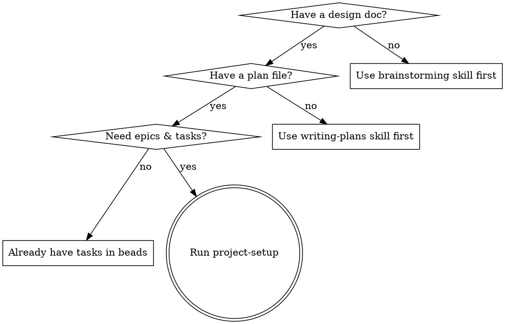

# Project Setup

Convert a plan file into beads epics and tasks with TDD-quality descriptions,
filled implementation prompts, and ready-to-use worktrees.

**Core principle:** Task descriptions are the source of truth. Each task is a
self-contained implementation guide — detailed enough for an agent to work
autonomously.

**Announce at start:** "I'm using the project-setup skill to decompose this
plan into epics and tasks."

## When to Use



**Don't use when:**

- No design doc exists yet — use brainstorming skill first
- No plan file exists yet — use writing-plans skill first
- Tasks already exist in beads — go straight to implementation

## Inputs

Primary input: **plan file path** (output of writing-plans, e.g.
`dev-docs/plans/2026-02-21-feature-plan.md`). The plan references the design doc —
both are read in Phase 1.

Also needed from CLAUDE.md or conversation context:

- **Project root** — absolute path to the project
- **Tech stack** — languages, frameworks, tools in use
- **Quality commands** — test/lint commands (e.g. `make test && make lint`)
- **Coverage target** — minimum coverage threshold (e.g. `>80%`)

If any are missing, ask the user (prefer multiple choice when possible).

## Phase 1: Understand the Plan

Read the plan file and the design doc it references. Identify major phases,
components, data flow, and interfaces. Use sub-agents to explore the codebase
in parallel — scan for existing patterns, check `bd list` / `bd ready` /
`bd blocked` for related work.

Ask the user focused questions (prefer multiple choice) about anything the plan
leaves ambiguous — constraints, scope boundaries, patterns to follow.

## Phase 2: Decompose into Epics & Tasks

### Map Plan Phases to Epics

Map each plan phase to a beads epic. Each epic should:

- Represent a cohesive, independently deliverable unit of work
- Be completable in 1-3 agent sessions
- Have clear boundaries (a single worktree/branch per epic)
- Map to a logical layer or component from the design spec

**Naming:** Imperative form — "Implement Sync Protocol", "Build Session
Manager", "Create Filter Component".

Present the epic breakdown to the user for approval before creating anything.

### Create Epics in Beads

Once the user approves the epic breakdown:

```bash
bd create "Epic Title" --type=epic --priority=1

# If epics have ordering dependencies:
bd dep add <later-epic-id> <earlier-epic-id>
```

### Create Tasks

When creating > 6 tasks, delegate to parallel sub-agents — one per epic.

```bash
bd create "Task Title" --type=task --priority=2 \
  --parent=<epic-id> --description="Detailed description"

# Set ordering within the epic
bd dep add <later-task-id> <earlier-task-id>
```

**Task descriptions** are the source of truth for implementing agents. Each
description must include:

- **Files** — Exact paths to create, modify, and test
- **Steps** — Concrete code (not pseudocode), TDD order (test first)
- **Acceptance Criteria** — Checkboxes: tests pass, edge cases handled, etc.

Scale code detail to task type: API tasks need full signatures/types, business
logic needs full implementation, integration tasks need the wiring.

**Granularity:** Each task should be completable in one focused session. If a
task has more than 5 steps, split it.

### Set Dependencies

```bash
# Cross-epic dependencies
bd dep add <epic-2-id> <epic-1-id>

# Verify no circular dependencies
bd blocked
```

### Verify Setup

Before proceeding to Phase 3:

- [ ] Every task has a clear title and detailed description
- [ ] Task ordering within each epic makes sense (foundations first)
- [ ] Epic dependencies reflect the actual build order
- [ ] No circular dependencies (`bd blocked` should be clean)
- [ ] Each epic can be assigned to one worktree/branch
- [ ] Total scope is realistic (flag if > 20 tasks per epic)

## Phase 3: Select Worktrees & Agents

**This phase is an interactive decision gate.** You MUST ask the user which
worktree and agent to use for each epic before generating prompts. Do not infer
silently — present options and let the user choose.

### Step 1: Gather Current State

```bash
# List all active worktrees with branches
git worktree list

# Check which worktrees have in-progress beads tasks
bd list --status=in_progress

# Check for active agents on each worktree
thrum team --json
```

Parse `thrum team --json` to map worktree paths to active agent names (match
on the `worktree` field). Also check the CLAUDE.md worktree table for status
info (active/idle/merged).

### Step 2: Present Worktree Options

For each epic, use `AskUserQuestion` to let the user choose a worktree:

| Scenario                                           | Option label                          |
| -------------------------------------------------- | ------------------------------------- |
| Existing idle worktree with related branch         | "Reuse `<path>` (`<branch>`)"        |
| Existing idle worktree, unrelated branch           | "Reuse `<path>`, create new branch"  |
| No suitable worktree exists                        | "Create new worktree"                |
| Work is small enough for the current branch        | "Use current worktree (`<branch>`)"  |

Include in each option's description: worktree path, current branch, whether
clean, any active agent already on that worktree (name it explicitly), status
from CLAUDE.md.

For agent names, suggest a name derived from the feature (e.g., `impl_{feature}`).

### Step 3: Set Up the Chosen Worktree

#### For reused worktrees:

```bash
cd <worktree-path>
git status                          # Check if clean
git fetch origin && git rebase origin/<dev-branch>  # Catch up if behind
cat .thrum/redirect                 # Verify redirect
cat .beads/redirect                 # Verify redirect
bd where                            # Confirm shared beads database
```

If redirects are missing, run the worktree setup script in redirect-only mode.

**Agent registration — check for an existing agent first.** If `thrum team
--json` showed an active agent on this worktree, send the assignment to them
instead of registering a new one:

```bash
# Existing agent on this worktree:
thrum send "Assignment: implement <epic-id> (<epic-title>).
Worktree: <worktree-path>, branch: <branch-name>.
Start with: bd show <epic-id>" --to @<existing-agent-name>

# No active agent — register a new one:
thrum quickstart --name <agent-name> --role implementer \
  --module <branch> --intent "Implementing <epic-id>"
```

#### For new worktrees:

```bash
# From the project root — MUST pass --base thrum-dev
./scripts/setup-worktree-thrum.sh \
  <worktree-path> <branch-name> \
  --identity <agent-name> --role implementer --base thrum-dev
```

The setup script handles: branch creation, worktree creation, thrum redirect,
beads redirect, and `thrum quickstart` registration.

#### For current worktree (small fixes):

```bash
bd where && bd ready    # Verify beads
```

If an active agent already exists on this worktree, send the assignment to
them. Otherwise register a new agent:

```bash
# Existing agent: send work
thrum send "Assignment: implement <epic-id>" --to @<existing-agent-name>

# No active agent: register
thrum quickstart --name <agent-name> --role implementer \
  --module <current-branch> --intent "Implementing <epic-id>"
```

### Step 4: Verify & Record

Verify for each worktree: `bd where`, `thrum daemon status`, redirect files.

Record the confirmed assignments:

| Epic | Worktree Path | Branch | Agent Name |
|------|---------------|--------|------------|
| `<epic-id>` | `<path>` | `<branch>` | `<agent-name>` |

These values feed into Phase 4 placeholder resolution.

## Phase 4: Generate Implementation Prompts

For each epic/worktree assignment, generate a filled prompt file.

### Step 1: Read the template

```text
Read toolkit/templates/agent-dev-workflow/implementation-agent.md
```

This is the **source template**. Do not work from memory — read the actual file
every time.

### Step 2: Resolve all placeholders

Perform literal find-and-replace on every `{{PLACEHOLDER}}` in the template.
All worktree-related values come from the Phase 3 assignments:

| Placeholder            | Source                                              |
| ---------------------- | --------------------------------------------------- |
| `{{EPIC_ID}}`          | Beads epic ID from Phase 2                          |
| `{{EPIC_TITLE}}`       | Epic title (used in commit messages)                |
| `{{WORKTREE_PATH}}`    | **From Phase 3 worktree assignment**                |
| `{{BRANCH_NAME}}`      | **From Phase 3 worktree assignment**                |
| `{{PROJECT_ROOT}}`     | Absolute path to the project root                   |
| `{{DESIGN_DOC}}`       | **Absolute path** to the design spec                |
| `{{REFERENCE_CODE}}`   | Relevant reference code paths                       |
| `{{QUALITY_COMMANDS}}` | Test/lint commands                                  |
| `{{COVERAGE_TARGET}}`  | Coverage threshold (e.g., `>80%`)                   |
| `{{AGENT_NAME}}`       | **From Phase 3 agent registration**                 |
| `{{PLAN_FILE}}`        | **Absolute path** to the plan file (primary input)  |

**IMPORTANT — Absolute paths for gitignored files:** `{{DESIGN_DOC}}`,
`{{PLAN_FILE}}`, and the saved prompt path (`dev-docs/prompts/`) are typically
gitignored. Agents in worktrees cannot resolve relative paths to these files —
worktrees only share committed content. Always use absolute paths (e.g.,
`/Users/you/project/dev-docs/plans/file.md`, not `dev-docs/plans/file.md`).
This also applies to beads task descriptions.

**Do not omit, reorganize, or summarize any section of the template.** The
output must contain every section from the original with placeholders replaced.

### Step 3: Prepend feature-specific context

Add a header before the filled template with quick context, task inventory, and
architecture notes specific to this feature:

```markdown
# Implementation Prompt: {{FEATURE_NAME}}

> Generated by project-setup on YYYY-MM-DD Plan: {{PLAN_FILE}} Design doc:
> {{DESIGN_DOC}} Epic: {{EPIC_ID}} (N tasks)

## Quick Context

<!-- 2-3 sentences about what this epic delivers and key decisions -->

## Worktree Setup

Worktree ready at `{{WORKTREE_PATH}}` on branch `{{BRANCH_NAME}}`.
Agent `{{AGENT_NAME}}` registered.

---

## Implementation Agent Template

<!-- PASTE THE ENTIRE filled template below this line — every section, verbatim -->
```

### Step 4: Save and commit

Save to `dev-docs/prompts/{feature}.md`, then commit:

```bash
git add dev-docs/prompts/
git commit -m "plan: add implementation prompts for {{FEATURE_NAME}}"
```

## Common Mistakes

**Too vague tasks:** "Add validation" is not a step — complete code is.

**Too large tasks:** If a task has more than 5 steps, split it.

**Missing dependencies:** Always run `bd blocked` to verify.

**Skipping worktree selection:** Always ask the user; never silently assign.

**Duplicate agent registration:** Always run `thrum team --json` before
registering. If an agent is already active on the target worktree, send them
the assignment via `thrum send --to @<agent-name>` — do not run `thrum
quickstart` again.

**Wrong base branch:** Always pass `--base thrum-dev` explicitly.

**Generating prompts before worktree setup:** Prompts embed the worktree path,
branch, and agent name — confirm these in Phase 3 first.

**Using relative paths for gitignored files:** Plan files, design docs, and
prompts live in gitignored directories. Always use absolute paths.

## Output Summary

1. **Beads epics and tasks** with dependency DAG and TDD-quality descriptions
2. **Ready-to-use worktrees** with thrum/beads redirects and agents registered
3. **Filled implementation prompts** at `dev-docs/prompts/{feature}.md`
4. **All artifacts committed** to git

## Handoff

After setup is complete, each epic is ready for an implementation agent. The
filled prompt at `dev-docs/prompts/{feature}.md` is the session start prompt —
give it directly to the implementing agent.
